# Guía de despliegue

A lo largo de esta guía de despliegue vamos a explicar como montar un servidor en AWS para poder subir nuestra página web.

---

El primer paso que vamos a llevar a cabo es el de crear una VPC con las siguientes especificaciones:

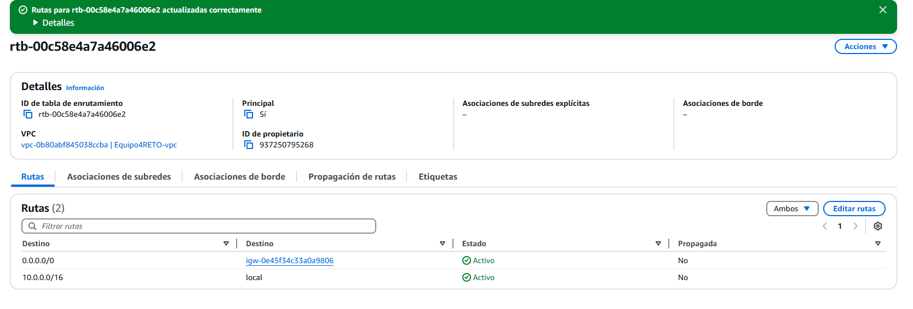

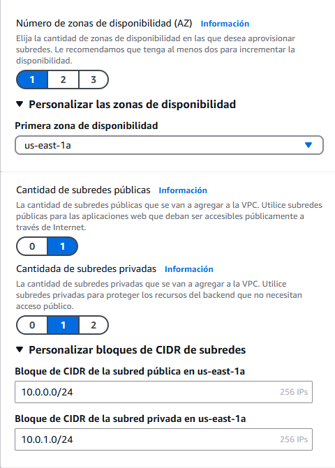

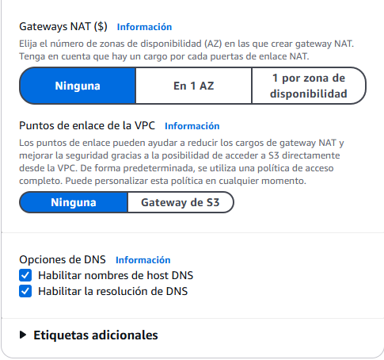

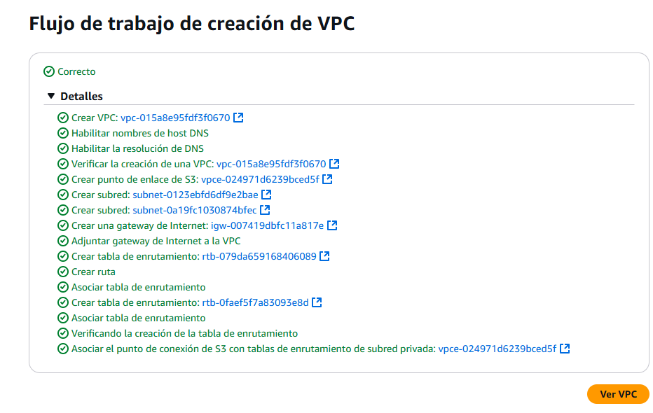

## Grupos de seguridad

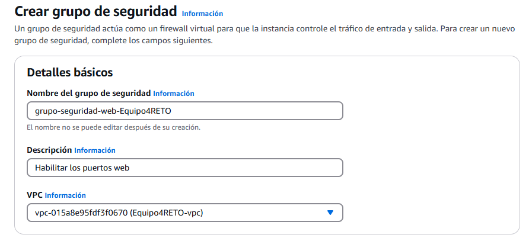

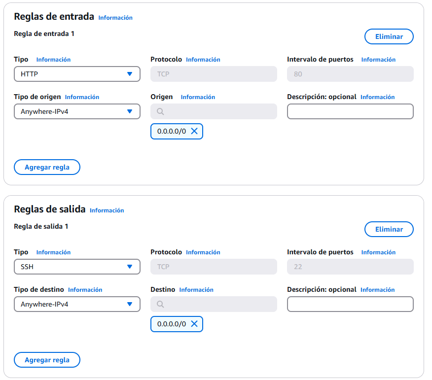

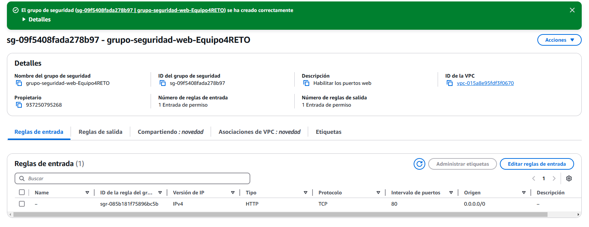

## Máquina Virtual EC2

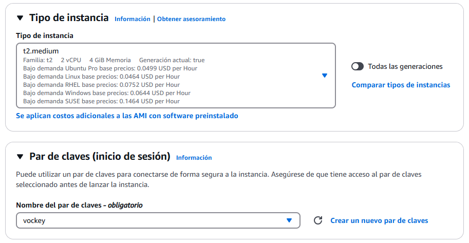

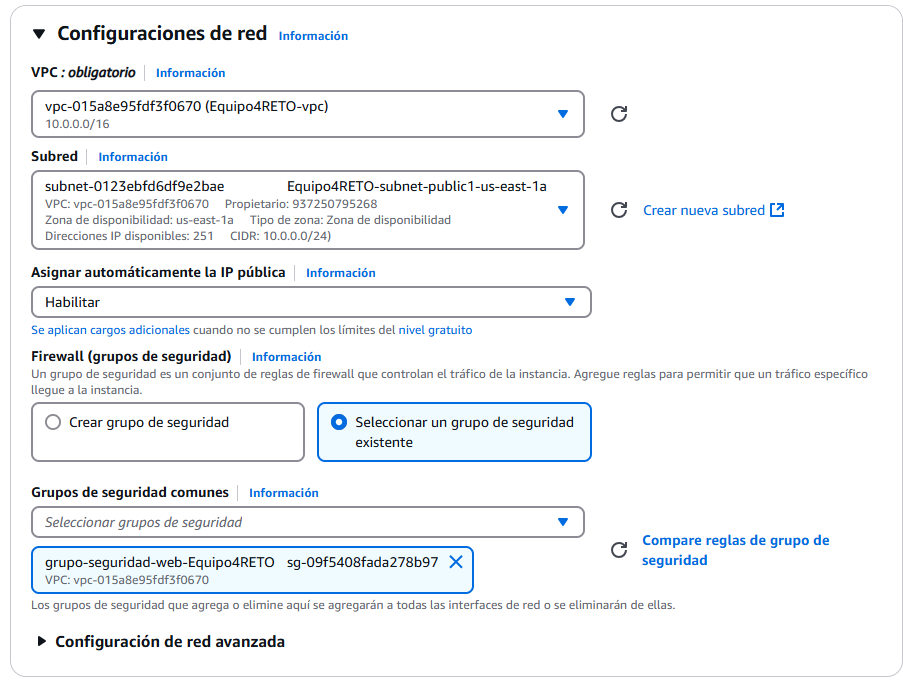

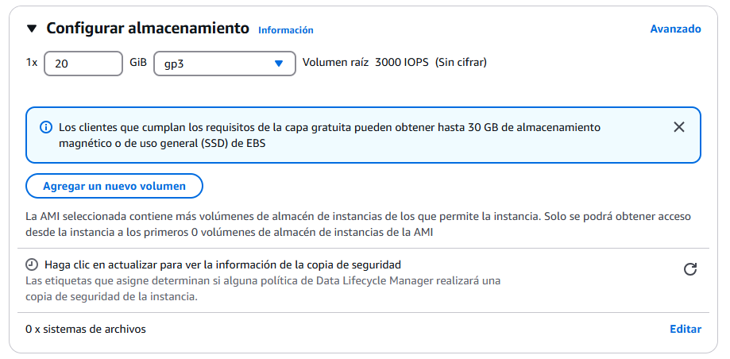

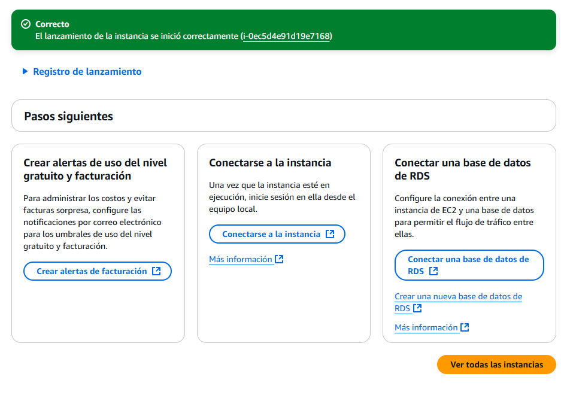

## Conexión desde la terminal

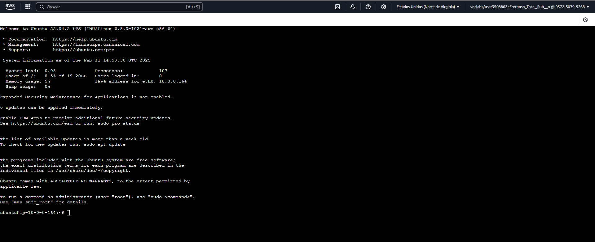

## Instalación y preparación del servidor en la MV de AWS

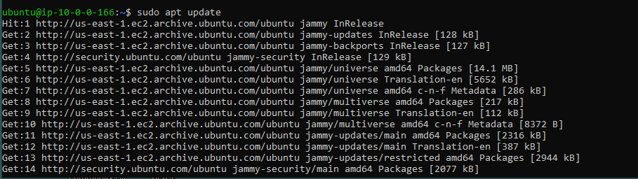

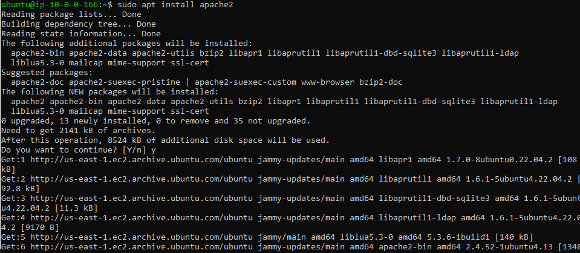

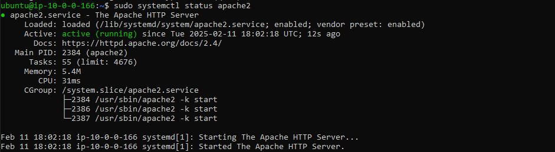

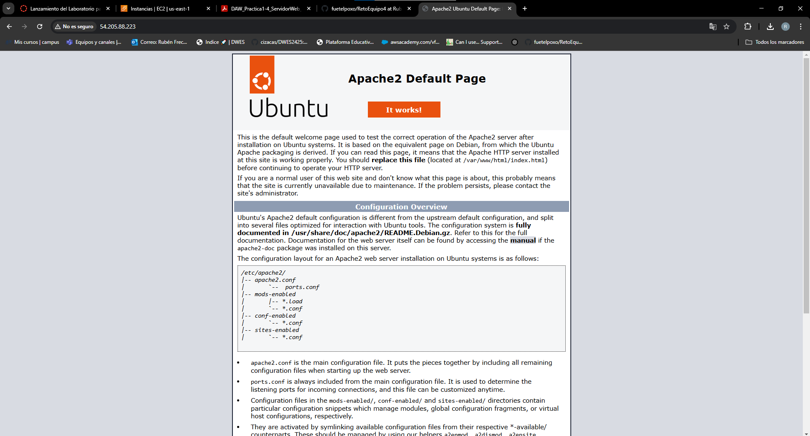

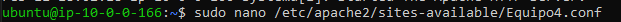

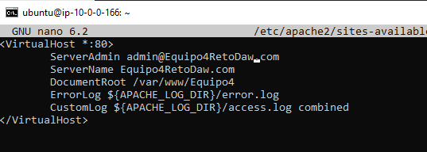

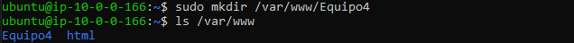

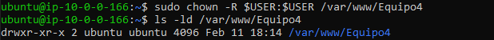

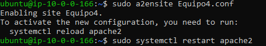

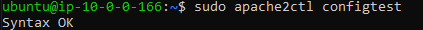

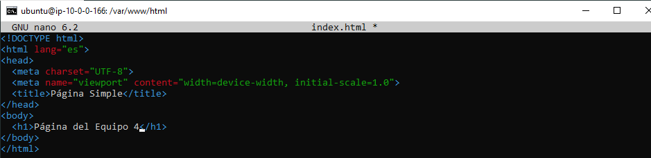

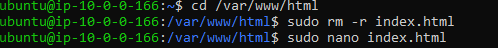

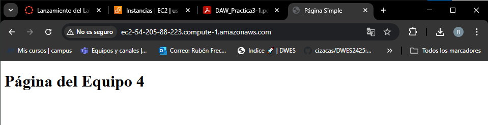

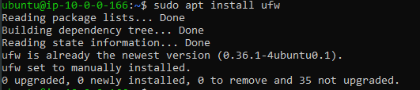

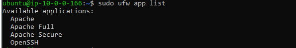

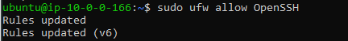

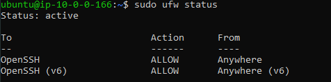

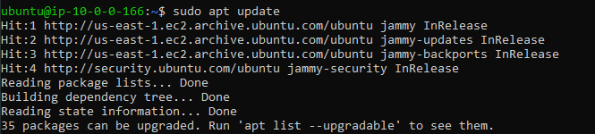

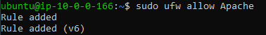