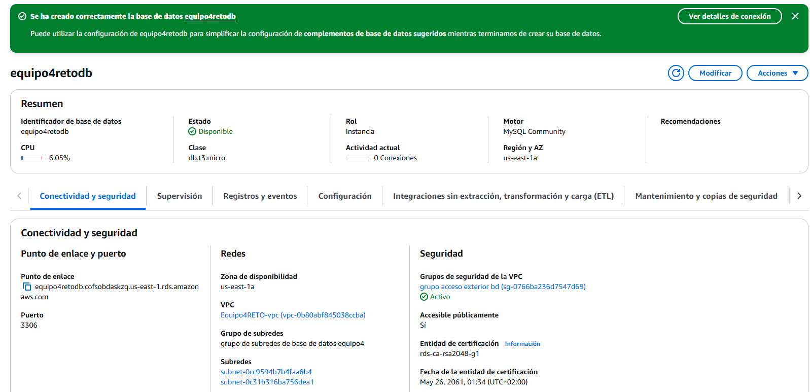
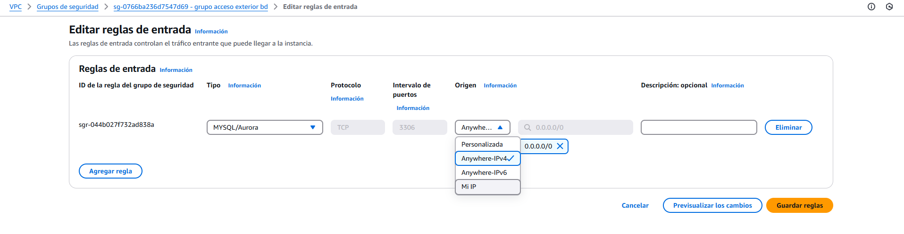
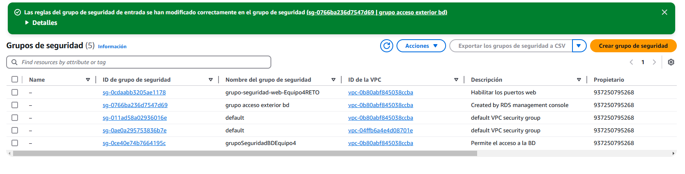
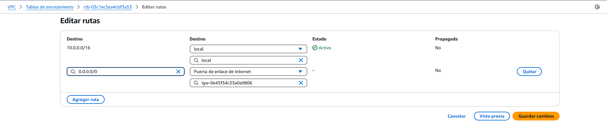
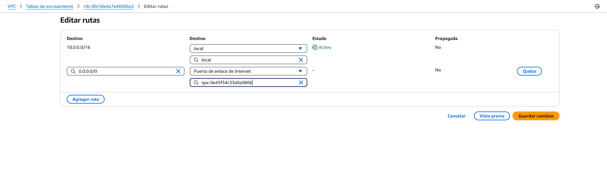
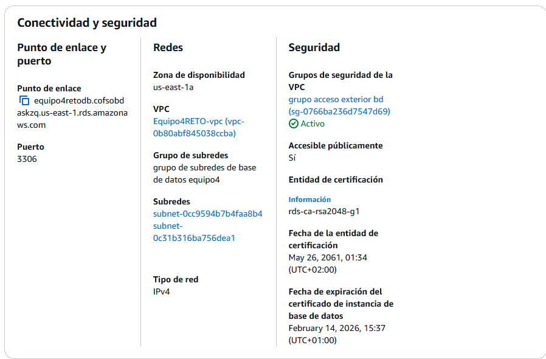
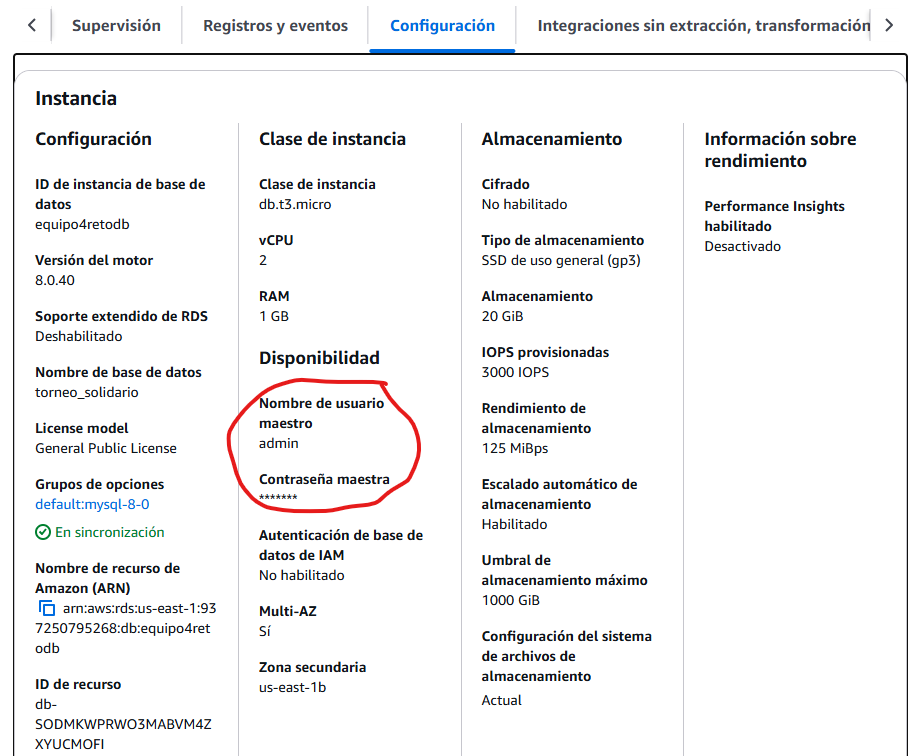

## Índice

1. [Introducción](#introducción)
2. [Creación de una VPC](#creación-de-una-vpc)
    - [Resumen creación VPC](#resumen-creación-vpc)
3. [Grupos de seguridad](#grupos-de-seguridad)
    - [Resumen grupo de seguridad](#resumen-grupo-seguridad)
4. [Máquina Virtual EC2](#máquina-virtual-ec2)
    - [Resumen de configuración de la MV EC2](#resumen-de-configuración-de-la-mv-ec2)
5. [Conexión a la MV](#conexión-a-la-mv)
6. [Instalación y preparación del servidor en la MV de AWS](#instalación-y-preparación-del-servidor-en-la-mv-de-aws)
7. [Grupo de seguridad para la Base de Datos](#grupo-de-seguridad-para-la-base-de-datos)
    - [Resumen Grupo Seguridad Base de Datos](#resumen-grupo-seguridad-base-de-datos)
8. [Creación de nueva zona de disponibilidad](#creación-de-nueva-zona-de-disponibilidad)
9. [Creación de grupo de subredes de base de datos](#creación-de-grupo-de-subredes-de-base-de-datos)
    - [Resumen de creación de un grupo de subredes de base de datos en Amazon RDS](#resumen-de-creación-de-un-grupo-de-subredes-de-base-de-datos-en-amazon-rds)
10. [Conexión de la Base de Datos](#conexión-de-la-base-de-datos)

# Introducción

A lo largo de esta guía de despliegue vamos a explicar como montar un servidor en AWS para poder subir nuestra página web, siguiendo todos los pasos y explicándolos para que se vea de forma correcta el proceso que hemos seguido para poder lanzar nuestra aplicaión en AWS.

## *Creación de una VPC*

El primer paso que vamos a llevar a cabo es el de crear una VPC (Virtual private Cloud), esto es una red privada dentro de AWS donde podremos desplegar nuestras instancias y recursos, la cual también nos permitirá definir subredes, grupos de seguridad y configuraciones de red personalizadas. A continuación, mostraremos la creación de la VPC con las especificaciones necesarias:

La VPC lleva el nombre "Equipo4RETO" que hace referencia al proyecto que llevamos a cabo. Por otra parte le asignamos un Bloque de CIDR (Classless Inter-Domain Routing) IPv4 que nos permitirá asignar rangos en direcciones IP. En nuestro caso le asignamos "10.0.0.0/16" lo que significa que la VPC tendrá las direcciones disponibles desde "10.0.0.0 hasta 10.0.255.255".

Marcamos una sola zona de disponibilidad las cuales son centros de datos dentro de una región de AWS. Nosotros hemos marcado la zona "ues-east-1a" que nos indica que los recursos se crearán en la primera zona de disponibilidad de la región a la que hace referencia (US East - North Virginia).

Como podemos ver asignamos una subred pública y otra privada dentro del bloque CIDR de subredes. La red pública será "10.0.0.0/24" (de la 10.0.0.0 a la 10.0.0.255) y la red privada será "10.0.1.0/24" (de la 10.0.1.0 a la 10.0.1.255), lo que significa que tendrán 256 direcciones IP disponibles cada una. 
 

En los puntos de enlace de a VPC marcamos la opción "Ninguna", porque si marcamos la opción "Gateway de S3" en el mapa de recursos nos aparecerá otra red que se conecta a la subred privada y nos dará problemas a la hora de que la MV que crearemos se pueda conectar a la red.

Este es el mensaje que nos indica que se ha creado correctamente. En la imagen podemos ver todo lo que se ha creado en la confección de la VPC sin tener ningún fallo.

### Resumen creación VPC

| Configuración          | Valor                                   |
|------------------------|-----------------------------------------|
| **Nombre de la VPC**  | `Equipo4RETO`                       |
| **CIDR de la VPC**    | `10.0.0.0/16`                           |
| **Zona de Disponibilidad** | `us-east-1a`                     |
| **Red Pública**       | `10.0.0.0/24`                           |
| **Rango de IPs Públicas** | `10.0.0.1 - 10.0.0.254`            |
| **Subred Privada**    | `10.0.1.0/24`                           |
| **Rango de IPs Privadas** | `10.0.1.1 - 10.0.1.254`            |
| **Gateway NAT**       | `No configurado`                        |

## *Grupos de seguridad*

Los grupos de seguridad en AWS actúan como un firewall para controlar que tráfico puede entrar o salir de una instancia EC2.

El nombre elegido para el grupo de seguridad es "grupo-seguridad-web-Equipo4RETO". Este grupo de seguridad le utilizaremos para habilitar los puertos web y le asignamos a la VPC creada anteriormente.

Creamos dos reglas de entrada. la primera es para permitir el tráfico HTTP, actuará en el puerto 80 y marcamos en tipo de origen "Anywhere IPv4" (0.0.0.0/0) que significa que cualquier dispositivo de Internet puede acceder al servidor a través del puerto especificado, está regla la necesitaremos para servir páginas web. La segunda regla es para permitir el tráfico de SSH y actuará en puerto 22 y como en la anterior marcamos el mismo tipo de origen el cual servirá para lo mismo, en este caso la regla la utilizaremos para conectarnos a la instancia y administrarla.

Este panel nos muestra que el grupo de seguridad se ha creado correctamente además de sus especificaciones.

### Resumen grupo seguridad

| Configuración               | Valor                                      |
|-----------------------------|--------------------------------------------|
| **Nombre del Grupo de Seguridad** | `grupo-seguridad-web-Equipo4RETO`             |
| **Descripción**             | `Habilitar los puertos de web`             |
| **VPC Asociada**            | `Equipo4RETO`                          |
| **Reglas de Entrada**       | `Puerto 80 (HTTP) - Acceso Público`        |
|                             | `Puerto 22 (SSH) - Acceso Restringido`     |

## *Máquina Virtual EC2*

Vamos a crear una máquina virtual en AWS (EC2) que actuará como servidor web con las siguientes características:

Como nombre le daremos "ServidorWebEquipo4RETO" y el Sistema operativo que utilizaremos es "Ubuntu Server 22.04" la versión LTS (Long Term Support) ya que es una versión estable y optimizada de Ubuntu para servidores. Como vemos AWS nos ofrece imágenes preconfiguradas AMI(Amazon Machine Images) para diversos Sistemas Operativos.

EL tipo de instancia que vamoa a elegir es "T2.medium", la cual consta de 2 vCPUs (procesadores virtuales) y de 4GB de RAM. En el caso de que la aplicación fuese muy grande o si en un futuro crece demasiado habría que cambiar a una instancia más grande, es decir, que tenga mas capacidad.

Además elegiremos la opción de crear un par de claves vockey (pública y privada) que se usan para acceder por SSH a la instancia.

Dentro de la configuración de red de la Máquina Virtual, le asignamos la vpc creada al principio y la subred pública "Equipo4RETO-subnet-public1-us-east-1a". La instancia creará esta subred dentro de la VPC y al ser pública  permitirá el acceso a internet.

Habilitaremos la IP pública que se asignará a la instancia, lo que permitirá el acceso desde fuera de AWS (necesario para el servidor web y SSH).

Usaremos el grupo se seguridad "grupo-seguridad-web-Equipo4RETO" que nos permite el acceso por HTTP y SSH.

Optaremos por 20GB SSD de almacenamiento que es suficiente para un servidor web básico y en el caso de necesitar más sólo tendríamos que aumentarlo.

Aquí vemos que se ha creado correctamente.

### *Resumen de configuración de la MV EC2*

| Configuración        | Valor |
|---------------------|---------------------------|
| **Nombre** | `ServidorWebEquipo4RETO` |
| **SO** | Ubuntu Server 22.04 |
| **Tipo de Instancia** | T2.medium (2 vCPU, 4GB RAM) |
| **Clave SSH** | `vockey.pem` |
| **Red** | Subred pública (`Equipo4RETO-subnet-public1-us-east-1a`) |
| **IP Pública** | Activada |
| **Grupo de Seguridad** | `grupo-seguridad-web-Equipo4RETO` (HTTP y SSH abiertos) |
| **Almacenamiento** | 20GB SSD |

## *Conexión a la MV*

La primera forma que tenemos de conectarnos a nuestra instancia es mediante el apartado de Conexión de la instancia EC2, el cual nos conectará directamente con la MV que hemos creado.

Como vemos, ya estamos conectados a la MV y podemos empezar a trabajar con ella.

La segunda forma de conectarnos a la MV es a través de la cmd del ordenador a través del cliente SSH. Lo primero que tenemos que hacer es descargarnos el PEM(Privacy-Enhanced Mail) que utilizamos comúnmenete para almacenar claves privadas y certificados. Este archivo lo guardaremos en un carpeta en la siguiente ruta:

El siguiente paso es irnos al apartado de Cliente SSH y copiar el siguiente comando:

Dentro del cmd nos situamos dentro de la carpeta mostrada antes y copiamos el comando cambiando el nombre de "vockey.pem" por "labsuser.pem" que es el nombre del archivo pem que nos hemos descargado.

Como vemos ya estaríamos conectados ya ya podríamos empezar a configurarla.

## *Instalación y preparación del servidor en la MV de AWS*

En este apartado vamos a mostrar como preparar el servidor para poder alojar nuestro proyecto.

Lo primero que realizamos es `sudo apt update` para actualizar todos los paquetes existentes y que descargue todo lo necesario para la configuración que vamos a realizar.

Instalamos el servidor de apache a través del comando `sudo apt install apache2`.

Comprobamos que el servidor este funcionando correctamente utilizando `sudo systemctl status apache2`, que nos muestra el estado actual del servidor.

A través de la IP de la máquina virtual vemos en el buscador que nos muestra la web por defecto de apache, loq ue significa que se ha instalado correctamente. Esta página de muestra la cambiaremos más adelante para mostrar lo que nosotros queramos.

Crearemos el archivo de configuración necesario para que nuestro host virtual funcione y opere desde una ruta en la que crearemos el directorio donde guardaremos nuestro proyecto.

Esta es la información que tiene el archivo de configuración que estamos creando.

Creamos el directorio mecionado anteriormente y nos aseguramos de que se ha creado correctamente. Como vemos dentro de la ruta especificada, se encuentra nuestro directorio.

Cambiamos los permisos de propiedad del directorio y nos aseguramos de que se ha realizado correctamente utilizando el segundo comando `ls -ld /var/www/Equipo4`, que nos muestra los permisos y propiedades del directorio sin listar us contenido.

Utilizamos el comando `sudo a2ensite Equipo4.conf` para habilitar nuestro sitio web. Y luego reiniciamos el servidor para que los cambios realizados se guarden.

Verificamos de que la configuración sea correcta.

En la ruta indicada en la imagen removemos el archivo `index.html` que hay por defecto y creamos el nuestro propio, para hacer pruebas y ver que funciona y se muestra nuestra web.

Contenido de la web de prueba.

Y esta sería la salida, es decir, el contenido antes mostrado, reflejado en el buscador.

El siguiente paso que vamos a seguir es la instalacion de ufw (Uncomplicated Firewall), es decir, vamos a instalar un firewall en nuestra EC2 a través del siguiente comando. Esto nos permitirá mejorar la seguridad de nuestro servidor, permitiendo solo el tráfico necesario y bloqueando el resto.

SUDO UFW ENABLE para iniciar el ufw

Con el siguiente comando podemos gestionar las reglas de firewall sin necesidad de explicar manualmente los puertos. En este caso solo mostramos una lista de los servicios que pueden ser gestionados fácilmente con UFW.

En las dos siguientes imágenes mostramos los comandos `sudo ufw allow apache` y `sudo ufw allow OpenSSH` con los que vamos a permitir el tráfico de red para el servidor web Apache a través del firewall UFW, y por otro lado, permitiremos también el tráfico de red en el puerto por defecto de OpenSSH (puerto 22) a través del firewall UFW.

Mostramos la lista de reglas activas.

Utilizamos otra vez `sudo apt update` para asegurarnos que nuestro sistema tenga la información más reciente sobre los paquetes y versiones disponibles para instalar o actualizar.

## *Grupo de seguridad para la Base de Datos*

En este apartado, configuraremos un grupo de seguridad para controlar el acceso entre un servidor web y una base de datos que se encuentra en Amazon RDS.

EL nombre que le otorgamos al grupo de seguridad es "grupoSeguridadBDEquipo4". Este lo vamos a utilizar para permitir el acceso a la base de datos y le asignamos la VPC con la que llevamos trabajando desde el principio de la guía.

Agregamos una regla de entrada de tipo MYSQL/Aurora porque el puerto 3306 es el que utilizan las bases de datos MySQL y Aurora (de Amazon). Esto ons indica que el grupo de seguridad permitirá conexiones a través de ese puerto. En el "Origen" hemos marcado el grupo de seguridad que creamos al principio, esto nos asegurará que el tráfico de entrada en el puerto 3306 solo sea aceptado desde las instancias que estén asociadas a este grupo de seguridad web, y no desde otras instancias o direcciones IP externas.

Vemos que se ha creado correctamente y toda la información que hace referencia a la configuración realizada.

### *Resumen Grupo Seguridad Base de Datos*

| Configuración              | Valor                                                                                          |
|----------------------------|------------------------------------------------------------------------------------------------|
| **Nombre del Grupo de Seguridad** | `grupoSeguridadDBEquipo4`                                                                             |
| **Descripción**            | `Permite el acceso a la BD`                                                                    |
| **VPC**                    | `Equipo4RETO-`                                                                            |
| **Tipo de Puerto**         | `MySQL/Aurora (3306)`                                                                           |
| **Origen (Regla de Entrada)** | `Grupo de seguridad web` (Permite acceso solo desde las instancias asociadas a este grupo)     |
| **Acceso Permitido**       | Acceso al puerto 3306 solo desde las instancias asociadas al `grupo-seguridad-web-Equipo4RETO`         |

## *Creación de nueva zona de disponibilidad*

Vamos a agregar una nueva zona de disponibilidad en AWS, dentro de la cual vamos a crear dos subredes (una pública y una privada).

Primero la vamos a asociar con la VPC que llevamos trabajando durante todo el proceso de creación del servidor.

El nombre que le hemos dado a la subred pública es "lab-subnet-public2-us-east-1b" y como su nombre indica elegiremos la zona de disponibilidad "us-east-1b". El bloque de CIDR de VPC IPv4 que utilizaremos es "10.0.2.0/24" lo que significa que la subred que estamos creando tendrá 256 direcciones IP disponibles.

En el caso de la subred privada, le otorgamos el nombre de "lab-subnet-private2-us-east-1b", para la cual elegiremos la misma zona de disponibilidad que la subred pública. El bloque de CIDR de VPC IPv4 que utilizaremos es "10.0.3.0/24".

Se ha creado correctamente.

###  Resumen de creación de subredes en la zona de disponibilidad  

| **Recurso** | **Configuración** |
|------------|------------------|
| **VPC** | `Equipo4RETO` |
| **Zona de disponibilidad** | `us-east-1b` |
| **CIDR de la VPC** | `10.0.0.0/16` |

#### **Subred Pública**  
| **Parámetro** | **Valor** |
|--------------|----------|
| **Nombre** | `lab-subnet-public2-us-east-1b` |
| **CIDR Block** | `10.0.2.0/24` |

#### **Subred Privada**  
| **Parámetro** | **Valor** |
|--------------|----------|
| **Nombre** | `lab-subnet-private2-us-east-1b` |
| **CIDR Block** | `10.0.3.0/24` |

 

## *Creación de grupo de subredes de base de datos*

En este apartado, vamos a crear más subredes, pero en este caso serán para la base de datos.

Como podemos ver le asignamos a la VPC "Equipo4RETO" como siempre, ya que es la única de la que disponemos y con la que estamos trabajando.

En el apartado de zonas de disponibilidad elegimos las 2 primeras que nos aparecen que son "us-east-1a" y "us-east-1b". Las subredes que utilizaremos son las dos privadas con las que contamos que utilizan los rangos  de CIDR "10.0.1.0/24" y "10.0.3.0/24".

Por último, le damos a crear subred y vemos que se han creado correctamente-

### Resumen de creación de un grupo de subredes de base de datos en Amazon RDS 

| **Parámetro** | **Valor** |
|--------------|----------|
| **Nombre** | `grupo de subredes de base de datos Equipo4` |
| **Descripción** | `Grupo de subredes de base de datos` |
| **VPC** | `Equipo4RETO` |
| **Zonas de disponibilidad** | `us-east-1a`, `us-east-1b` |
| **Subredes** | `10.0.1.0/24` (privada en us-east-1a)   `10.0.3.0/24` (privada en us-east-1b) |

## *Creación de base de datos*

Vamos a proceder con la creación de la base de datos con la que trabajaremos a la hora de utilizar nuestro proyecto.

Elegimos la creación estándar y el tipo de base de datos que vamos a utilizar es MySQL.

La plantilla que utilizaremos es la de "producción".

En el apartado de "Disponibiliad y durabilidad"  marcamos la opción "Instancia de base de datos Multi-AZ, que como se nos indica en la imagen, esto nos cera una instancia de base de datos primaria y una instancia de base de datos en espera en una zona de disponibilidad diferente. Nos proporciona también una alta disponibilidad y redundancia de datos, pero la instancia de base de datos en espera no admite conexiones para cargas de trabajo de lectura.

Dentro de la configuración utilizamos "equipo4reto" como identificador de instancias de bases de datos, el nombre del usuario maestro será "admin" y será "autoadministrado". 

En la configuración de la instancia elegimos "clases ampliables" y "db.t3.micro" que será la capacidad de nuestra base de datos.

En el apartado de "Conectividad" marcamos la opción "No se conecta a un recurso informático EC2", le asignamos nuestra VPC, le asignamos también el grupo de subredes de la base de datos ("grupo de subredes de base de datos equipo4") y el acceso será público.

Crearemos un nuevo grupo de seguridad que utilizaremos para permitir el acceso a nuestra base de datos.

Dentro del apartado de "Configuración adicional", indicaremos el nombre de la base de datos y desactivaremos los siguientes parámetros:

    - Habilitar copias de seguridad automáticas.
    - Habilitar el cifrado.
    - Habilitar actualización automática de versiones secundarias.

La siguiente configuración que aparece no la tocaremos.

FALLOS PARA PREGUNTAR A MANU

- Vemos que se ha creado correctamente.

## *Conexión de la Base de Datos*

- Una vez creada la base de datos vamos a ir a la vpc creada y cambiamos las reglas de entrada para qe permita la entrada desde cualquier IPv4 (AnywhereIPv4).

- Nos dirigimos al apartado "RDS" y dentro de él a "grupo se subredes" donde asignaremos a una de las subredes privadas para el acceso a internet.

 Una vez configurado el enrutador con la puerta de enlace de internet, configuraremos el acceso desde MySQLWorkbench. Para ello necesitaremos lo siguiente: 

- Puerto de enlace & puerto que lo encontramos en el apartado de conectividad y seguridad.

- Nombre del usuario maestro.

A continuación configuraremos la conexión en MySQLWorkbench.

