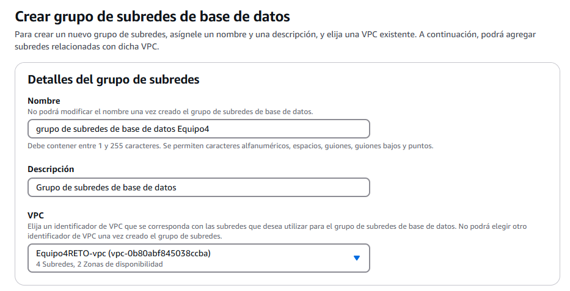

# Guía de despliegue

A lo largo de esta guía de despliegue vamos a explicar como montar un servidor en AWS para poder subir nuestra página web, siguiendo todos los pasos y explicándolos para que se vea de forma correcta el proceso que hemos seguido para poder lanzar nuestra aplicaión en AWS.

---

## *Creación de una VPC*
El primer paso que vamos a llevar a cabo es el de crear una VPC (Virtual private Cloud), esto es una red privada dentro de AWS donde podremos desplegar nuestras instancias y recurso la cual también nos permitirá definir subredes, grupos de seguridad y configuraciones de red personalizadas. A continuación mostraremos la creación de la VPc con las especificaciones necesarias:

- La VPC lleva el nombre "Equipo4RETO" que hace referencia al proyecto que llevamos a cabo. Por otra parte le asignamos un Bloque de CIDR (Classless Inter-Domain Routing) IPv4 que nos permitirá asignar rangos en direcciones IP. En nuestro caso le asignamos "10.0.0.0/16" lo que significa que la VPC tendrá las direcciones disponibles desde "10.0.0.0 hasta 10.0.255.255".

- Marcamos una sola zona de disponibilidad las cuales son centros de datos dentro de una región de AWS. Nosotros hemos marcado la zona "ues-east-1a" que nos indica que los recursos se crearán en la primera zona de disponibilidad de la región a la que hace referencia (US East - North Virginia).

- Como podemos ver asignamos una subred pública y otra privada dentro del bloque CIDR de subredes. La red pública será "10.0.0.0/24" (de la 10.0.0.0 a la 10.0.0.255) y la red privada será "10.0.1.0/24" (de la 10.0.1.0 a la 10.0.1.255), lo que significa que tendrán 256 direcciones IP disponibles cada una. 
 

- En los puntos de enlace de a VPC marcamos la opción "Ninguna", porque si marcamos la opción "Gateway de S3" en el mapa de recursos nos aparecerá otra red que se conecta a la subred privada y nos dará problemas a la hora de que la MV que crearemos se pueda conectar a la red.

- Este es el mensaje que nos indica se ha creado correctamente. En la imagen podemos ver todo lo que se ha creado en la confección de la VPC y que no ha dado ningún fallo.

## *Grupos de seguridad*

Los grupos de seguridad en AWS actúan como un firewall para controlar que tráfico puede entrar o salir de una instancia EC2.

- El nombre elegido para el grupo de seguridad es "grupo-seguridad-web-Equipo4RETO". Este grupo de seguridad le utilizaremos para habilitar los puertos web y le asignamos a la VPC creada anteriormente.

- Creamos dos reglas de entrada. la primera es para permitir el tráfico HTTP, actuará en el puerto 80 y marcamos en tipo de origen "Anywhere IPv4" (0.0.0.0/0) que significa que cualquier dispositivo de Internet puede acceder al servidor a través del puerto especificado, está regla la necesitaremos para servir páginas web. La segunda regla es para permitir el tráfico de SSH y actuará en puerto 22 y como en la anterior marcamos el mismo tipo de origen el cual servirá para lo mismo, en este caso la regla la utilizaremos para conectarnos a la instancia y administrarla.

- Este panel nos muestra que el grupo de seguridad se ha creado correctamente además de sus especificaciones.

## *Máquina Virtual EC2*

Vamos a crear una máquina virtual en AWS (EC2) que actuará como servidor web con las siguientes características:

- Como nombre le daremos "ServidorWebEquipo4RETO" y el Sistema operativo que utilizaremos es "Ubuntu Server 22.04" la versión LTS (Long Term Support) ya que es una versión estable y optimizada de Ubuntu para servidores. Como vemos AWS nos ofrece imágenes preconfiguradas AMI(Amazon Machine Images) para diversos Sistemas Operativos.

- EL tipo de instancia que vamoa a elegir es "T2.medium", la cual consta de 2 vCPUs (procesadores virtuales) y de 4GB de RAM. En el caso de que la aplicación fuese muy grande o si en un futuro crece demasiado habría que cambiar a una instancia más grande, es decir, que tenga mas capacidad.

- Además elegiremos la opción de crear un par de claves vockey (pública y privada) que se usan para acceder por SSH a la instancia.

- Dentro de la configuración de red de la Máquina Virtual, le asignamos la vpc creada al principio y la subred pública "Equipo4RETO-subnet-public1-us-east-1a". La instancia creará esta subred dentro de la VPC y al ser pública  permitirá el acceso a internet.

- Habilitaremos la IP pública que se asignará a la instancia, lo que permitirá el acceso desde fuera de AWS (necesario para el servidor web y SSH).

- Usaremos el grupo se seguridad "grupo-seguridad-web-Equipo4RETO" que nos permite el acceso por HTTP y SSH.

- Optaremos por 20GB SSD de almacenamiento que es suficiente para un servidor web básico y en el caso de necesitar más sólo tendríamos que aumentarlo.

- Aquí vemos que se ha creado correctamente.

### *Resumen de configuración de la MV EC2*

| Configuración        | Valor |
|---------------------|---------------------------|
| **Nombre** | `ServidorWebEquipo4RETO` |
| **SO** | Ubuntu Server 22.04 |
| **Tipo de Instancia** | T2.medium (2 vCPU, 4GB RAM) |
| **Clave SSH** | `vockey.pem` |
| **Red** | Subred pública (`Equipo4RETO-subnet-public1-us-east-1a`) |
| **IP Pública** | Activada |
| **Grupo de Seguridad** | `grupo-seguridad-web-Equipo4RETO` (HTTP y SSH abiertos) |
| **Almacenamiento** | 20GB SSD |

## Conexión a la MV

La primera forma que tenemos de conectarnos a nuestra instancia es mediante el apartado de Conexión de la instancia EC2, el cual nos conectará directamente con la MV que hemos creado.

Como vemos, ya estamos conectados a la MV y podemos empezar a trabajar con ella.

La segunda forma de conectarnos a la MV es a través de la cmd del ordenador a través del cliente SSH. Lo primero que tenemos que hacer es descargarnos el PEM(Privacy-Enhanced Mail) que utilizamos comúnmenete para almacenar claves privadas y certificados. Este archivo lo guardaremos en un carpeta en la siguiente ruta:

El siguiente paso es irnos al apartado de Cliente SSH y copiar el siguiente comando:

Dentro del cmd nos situamos dentro de la carpeta mostrada antes y copiamos el comando cambiando el nombre de "vockey.pem" por "labsuser.pem" que es el nombre del archivo pem que nos hemos descargado.

Como vemos ya estaríamos conectados ya ya podríamos empezar a configurarla.

## Instalación y preparación del servidor en la MV de AWS

## Grupo de seguridad para la Base de Datos

## Creación de subred pública y de la subred privada

## Creación de grupo de subredes de base de datos

