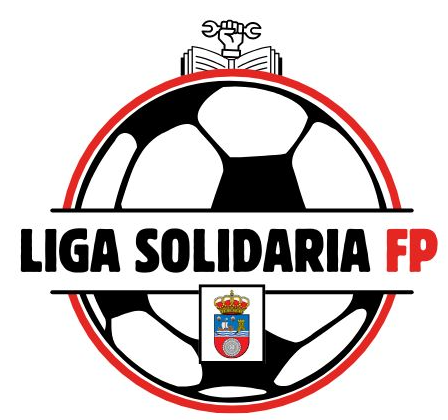

# Sede Torrelavega 

 

  

## Indice 📌
1. [Nombre del reto](#reto) 
2. [Miembros del equipo](#miembros) 
3. [Que ofrecemos](#ofrecer) 
4. [Diseño](#diseño) 
    - Gama de colores 
    - Vistas
    - Iconos
5. [Uso de la aplicacion](#aplicacion) 
    - Cuentas de acceso
    
6. Bibliografia y webgrafia 
7. Mejoras del producto y lo que falta 
8. Tutorial del uso de aplicacion 
9. [Manual de usuario]()  
10. Herramientas utilizadas

## Nombre del reto  📌
Liga solidaria 

##  Miembros del equipos 
1. Borja Falque 
2. Angel Fernandez
3. Nestor Serna 
4. Ruben Frechoso 
5. Elsa Ferreira 
6. Alberto Gonzalez
7. Marcos Cuevas 

## Que ofrecemos 📌 
- Con nuestra pagina web ofrecemos un perfil de equipos y jugadores
- Un sistema de competicion con sus reglas de juego, equipaciones,terreno de juego,arbitros,balones, numero de jugadores y suplentes  
- Una organizacion tecnica para eventos deportivos, catering
- Horarios
- Formulario de inscripcion para inscribir al equipo 

## Diseño 🨠

### Gama de colores 

 

Hemos optado por unos colores oscuros para que la pagina sea minimalista, con un toque llamativo a la hora de poner tonos rojos en botones para captar la atencion del usuario y que le incite a clickar 

### Vistas 

- Vista de Inicio
  

La vista de inicio es la pantalla principal de la aplicación web. Su propósito es proporcionar una introducción al usuario sobre el sistema y ofrecer opciones de navegación.
Contiene un texto introductorio que explica el propósito de la aplicación.

- Vista de Torneo de deportivo
  

Esta vista permite gestionar la información sobre torneos deportivos, incluyendo horarios, equipos y clasificaciones.

- Vista de reglamento
  

En esta vista se presentan las normas y regulaciones del torneo o del sistema en general

- Vista de equipos
  

Esta vista proporciona información detallada sobre un equipo en particular, incluyendo su entrenador y patrocinador.

- Vista Informacion para los equipos
  

En esta vista se muestra el entrenador y los jugadores de cada equipo 

- Vista para el login
  

Esta vista permite a los usuarios autenticarse en el sistema proporcionando sus credenciales.

- Vista para la inscripcion
  

En esta vista  permite seleccionar el entrenador, el capitan y los jugadores 

- Vista para el torneo solidario
  

Esta vista presenta la información sobre un torneo solidario, incluyendo sus objetivos, recaudación y patrocinadores

- Vista para retos
  

Esta vista muestra diferentes desafíos o retos en los que los usuarios pueden participar.

- Vista para cada rama profesional
  

Esta vista proporciona información detallada sobre una categoría profesional específica dentro de los retos.

### Iconos 

## Uso de la aplicacion 

### Cuentas de acceso ✔️
- 👨‍🏫 **Perfil de administrador:** tendra acceso a toda la gestion de la informacion web 
- 👨‍🏫 **Perfil de entrenador:** solamente tendrá acceso a la gestión de su equipo, permitiéndole publicar informacion sobre su equipo y su perfil de usuario 
- 👨‍🏫 **Perfil director torneo:** gestion de las actas de los partidos 
- 👨‍🏫 **Perfil periodista:** mantenimiento de las publicaciones, carrusel fotográfico e imágenes
***
Apartado para un formulario para que se puedan inscribir los equipos

## Mejoras del producto y lo que falta 

## Herramientas utilizadas  
- Visual Studio Code 
- AWS 
- MySQLWorkbech 
- JavaScrip
- PhpMainer 
- Color-generator (gama de colores)
 
