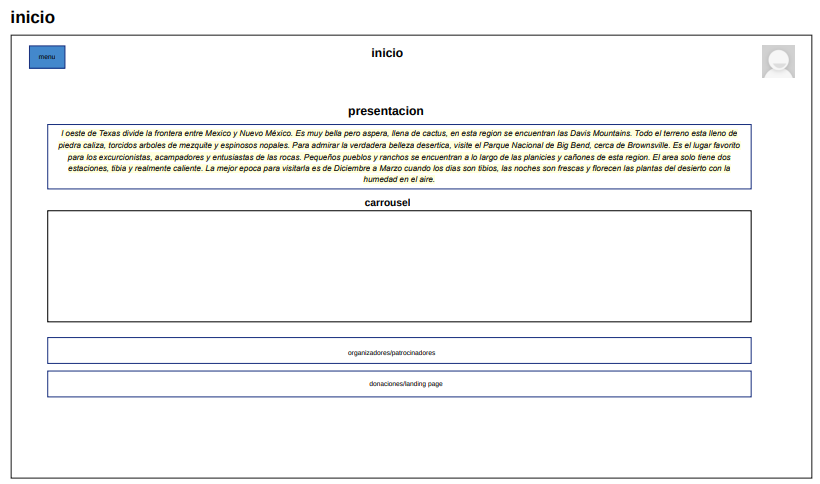
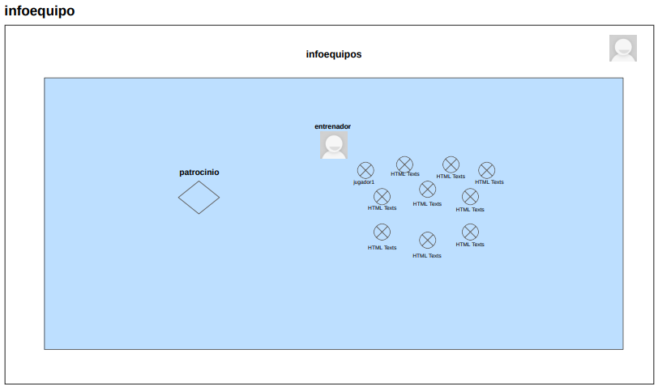
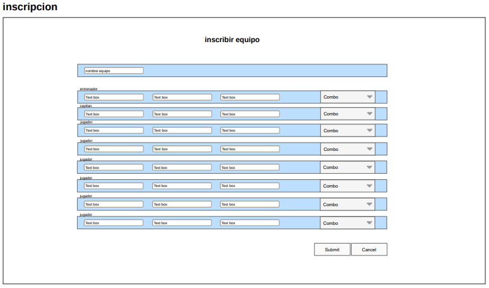
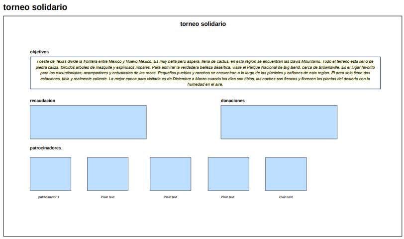
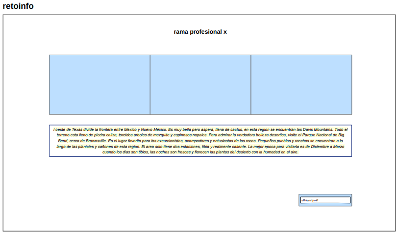

# Sede Torrelavega 

<br>
<p align="center" >
  <a href="">
    
  </a>
</p>

## Indice 📌
1. [Nombre del reto](#reto) 
2. [Miembros del equipo](#miembros) 
3. [Que ofrecemos](#ofrecer) 
4. [Diseño](#diseño) 
    - Gama de colores 
    - Vistas
    - Iconos
5. [Uso de la aplicacion](#aplicacion) 
    - Cuentas de acceso
6. [Software desarrollado](#software) 
7. Mejoras del producto y lo que falta 
8. Tutorial del uso de aplicacion 
9. [Manual de usuario]()  
10. Bibliografia y webgrafia 
11. Herramientas utilizadas

## Nombre del reto <a name="reto"></a> 📌
Liga solidaria 

##  Miembros del equipos 
1. Borja Falque 
2. Angel Fernandez
3. Nestor Serna 
4. Ruben Frechoso 
5. Elsa Ferreira 
6. Alberto Gonzalez
7. Marcos Cuevas 

## Que ofrecemos 📌 <a name="ofrecer"></a>
- Con nuestra pagina web ofrecemos un perfil de equipos y jugadores
- Un sistema de competicion con sus reglas de juego, equipaciones,terreno de juego,arbitros,balones, numero de jugadores y suplentes  
- Una organizacion tecnica para eventos deportivos, catering
- Horarios
- Formulario de inscripcion para inscribir al equipo 


## Diseño 🎨 <a name="diseño"></a>

### Gama de colores 

 


Hemos optado por unos colores oscuros para que la pagina sea minimalista, con un toque llamativo a la hora de poner tonos rojos en botones para captar la atencion del usuario y que le incite a clickar 

### Vistas 

- Vista de Inicio

La vista de inicio es la pantalla principal de la aplicación web. Su propósito es proporcionar una introducción al usuario sobre el sistema y ofrecer opciones de navegación.
Contiene un texto introductorio que explica el propósito de la aplicación.

- Vista de Torneo de deportivo


Esta vista permite gestionar la información sobre torneos deportivos, incluyendo horarios, equipos y clasificaciones.
A la derecha se muestran los equipos para las clasificatorias, en la izquierda se mostrara un horario con las finales, los grupos A y grupos B que seran los que se van a afrentar en los proximos partidos  

- Vista de reglamento 


En esta vista se presentan las normas y regulaciones del torneo o del sistema en general

- Vista de equipos


Esta vista proporciona información detallada sobre un equipo en particular, incluyendo su entrenador y patrocinador.

- Vista Informacion para los equipos


En esta vista se muestra el entrenador y los jugadores de ese mismo equipo y a su vez su patrocinio  

- Vista para el login 


Esta vista permite a los usuarios autenticarse en el sistema proporcionando sus credenciales 


- Vista para la inscripcion 


En esta vista permite seleccionar el entrenador, el capitan y los jugadores 

- Vista para el torneo solidario 

Esta vista presenta la información sobre un torneo solidario, incluyendo sus objetivos, recaudación y patrocinadores

- Vista para retos 


Esta vista muestra diferentes desafíos o retos en los que los usuarios pueden participar. Al clickar en uno de los retos te llevara a la siguiente vista "vista para cada rama profesional" en el que aparecera mas informacion 

- Vista para cada rama profesional 


Esta vista proporciona información detallada sobre una categoría profesional específica dentro de los retos, 


### Iconos 
   

- En el menu de la página de la pagina de se muestra este icono que da acceso a la pagina de logeo 
- 
## Uso de la aplicacion 

### Cuentas de acceso ✔️
- 👨‍🏫 **Perfil de administrador:** tendra acceso a toda la gestion de la informacion web 
- 👨‍🏫 **Perfil de entrenador:** solamente tendrá acceso a la gestión de su equipo, permitiéndole publicar informacion sobre su equipo y su perfil de usuario 
- 👨‍🏫 **Perfil director torneo:** gestion de las actas de los partidos 
- 👨‍🏫 **Perfil periodista:** mantenimiento de las publicaciones, carrusel fotográfico e imágenes
***
En la página principal se encuentra un menu en el que se mostraran los apartados que ofrecemos 
  - Apartado de equipos para consultar los que van a participar 
  - Apartado para que se puedan inscribir los equipos
  - Apartado "Torneo Solidario"
  - Apartado "Reglamento" con sus horarios, clasificacion, final, galería 
  
## Software de la aplicacion  <a name="software"></a>

### Estructura del proyecto


### Documentacion del código

``` java


 
```
### 🌐 API

| Método | Endpoint |  Descripción |
|-----------|-----------|-----------|
| GET   | api/usuarios   | Obtiene la listas de usuarios   |
| POST    | api/usuarios    | Crea un nuevo usuario    |

``` java
Ejemplo: 

{
  "id": 1,
  "nombre": "Juan Pérez",
  "email": "juan@example.com"
  "activo": 
  "perfil":
}
 
```

## Mejoras del producto y lo que falta 


## Herramientas utilizadas  
- Visual Studio Code 
- AWS 
- MySQLWorkbech 
- JavaScrip
- PhpMainer 
- Color-generator 
 