# Sede Torrelavega 

<br>
<p align="center" >
  <a href="">
    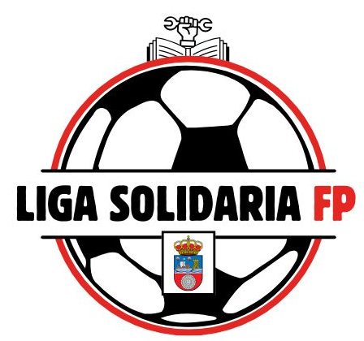
</p>

## Indice 📌
1. [Nombre del reto](#reto) 
2. [Miembros del equipo](#miembros) 
3. [Que ofrecemos](#ofrecer) 
4. [Diseño](#diseño) 
    - Gama de colores 
    - Vistas
    - Iconos
5. [Uso de la aplicacion](#aplicacion) 
    - Cuentas de acceso
6. [Software desarrollado](#software) 
7. Tutorial del uso de aplicacion 
9. Mejoras del producto y lo que falta 
10. Bibliografia y webgrafia 
11. Herramientas utilizadas
12. [Guia despliegue](https://github.com/fuetelpoxo/RetoEquipo4/blob/main/MD%20Despliegues/Despliegue.md) 

## Nombre del reto <a name="reto"></a> 📌
Liga solidaria 

##  Miembros del equipos 
1. Borja Falque 
2. Angel Fernandez
3. Nestor Serna 
4. Ruben Frechoso 
5. Elsa Ferreira 
6. Marcos Cuevas 

## Que ofrecemos 📌 <a name="ofrecer"></a>
Con nuestra pagina web pretendemos que el usuario pueda ver e informarse de lo que trata el torneo solidario de una forma clara, por otra parte 
habra diferentes tipos de usuarios con los que se podran logear dependiendo de su rol, en ella ofrecemos un apartado para 
los equipos que se quieran inscribir 

## Diseño 🎨 <a name="diseño"></a>

### Gama de colores 

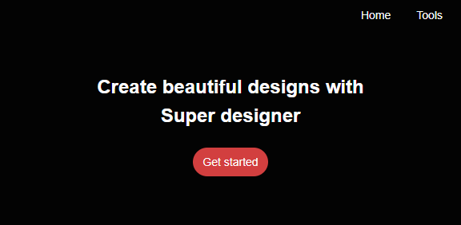 


Hemos optado por unos colores oscuros para que la pagina sea minimalista, con un toque llamativo a la hora de poner tonos rojos en botones para captar la atencion del usuario y que le incite a clickar 

### Vistas 

- Vista de Inicio
  
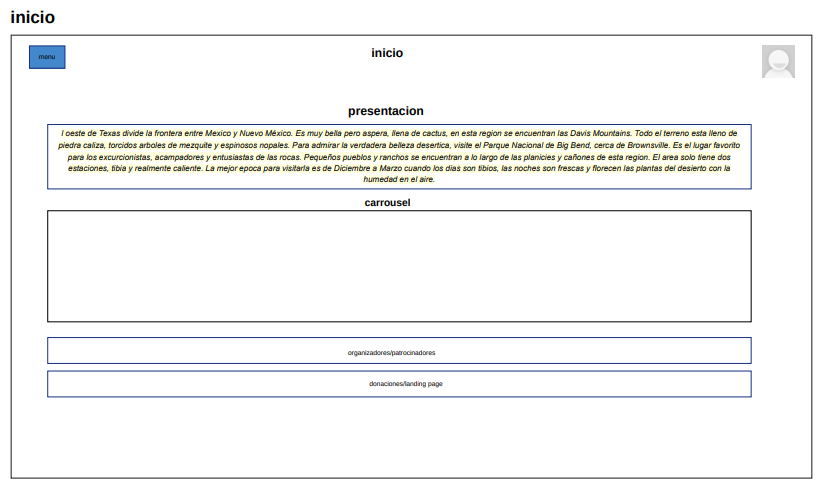

La vista de inicio es la pantalla principal de la aplicación web. Su propósito es proporcionar una introducción al usuario sobre el sistema y ofrecer opciones de navegación.
Contiene un texto introductorio que explica el propósito de la aplicación.

- Vista de Torneo de deportivo
  
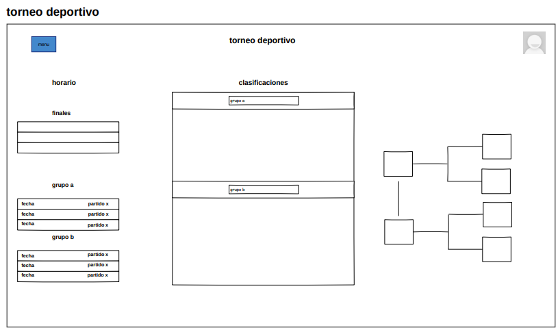
Esta vista permite gestionar la información sobre torneos deportivos, incluyendo horarios, equipos y clasificaciones.
A la derecha se muestran los equipos para las clasificatorias, en la izquierda se mostrara un horario con las finales, los grupos A y grupos B que seran los que se van a afrentar en los proximos partidos  

- Vista de reglamento 
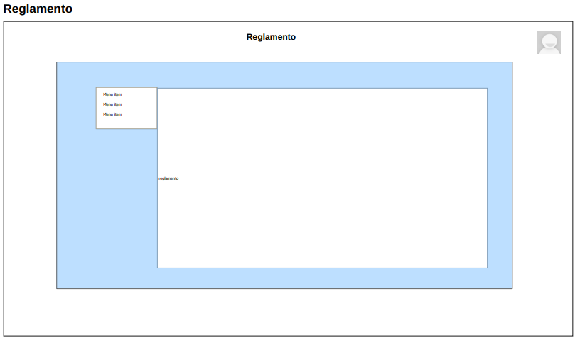
En esta vista se presentan las normas y regulaciones del torneo o del sistema en general

- Vista de equipos
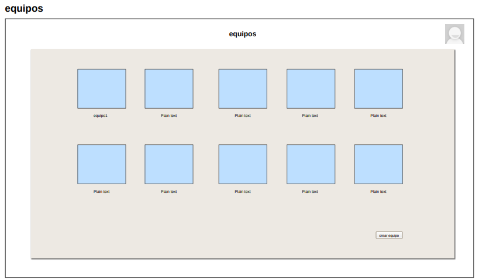
Esta vista proporciona información detallada sobre un equipo en particular, incluyendo su entrenador y patrocinador.

- Vista Informacion para los equipos
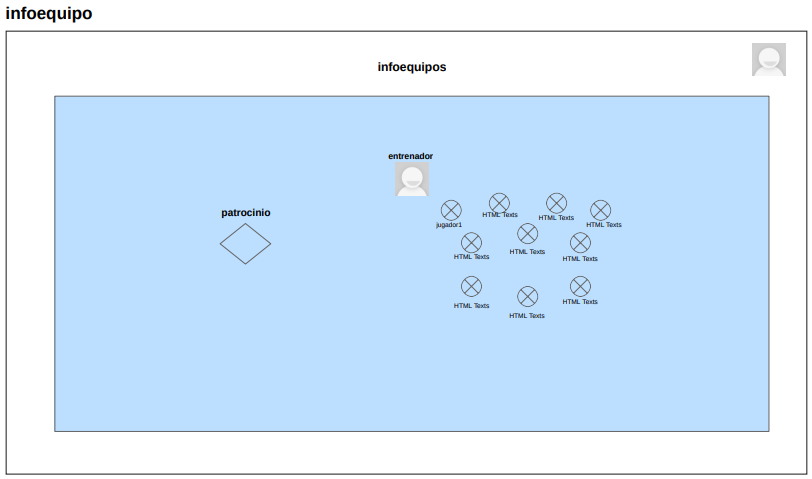
En esta vista se muestra el entrenador y los jugadores de ese mismo equipo y a su vez su patrocinio  

- Vista para el login 
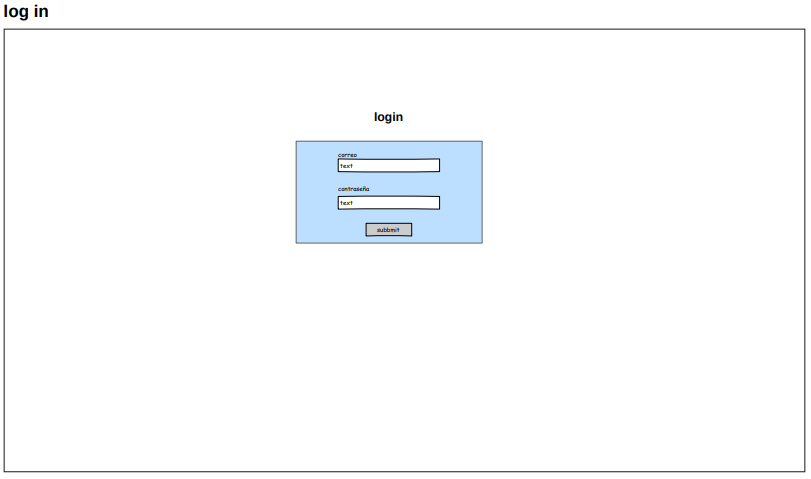
Esta vista permite a los usuarios autenticarse en el sistema proporcionando sus credenciales 

- Vista para la inscripcion 
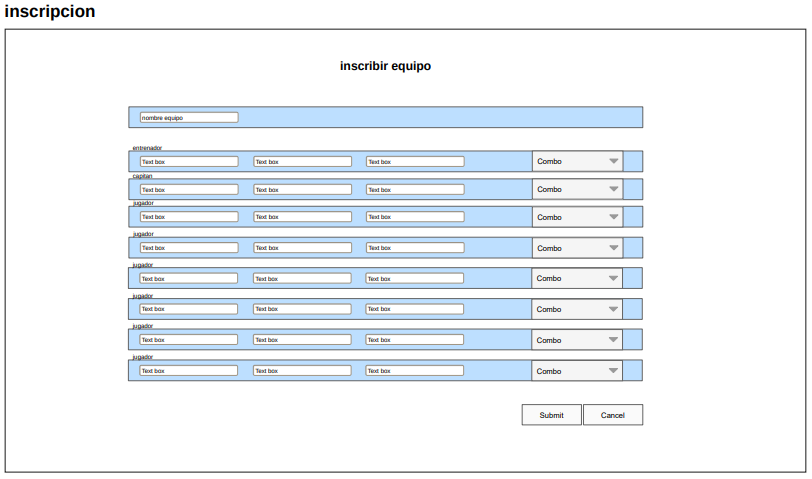
En esta vista permite seleccionar el entrenador, el capitan y los jugadores 

- Vista para el torneo solidario 
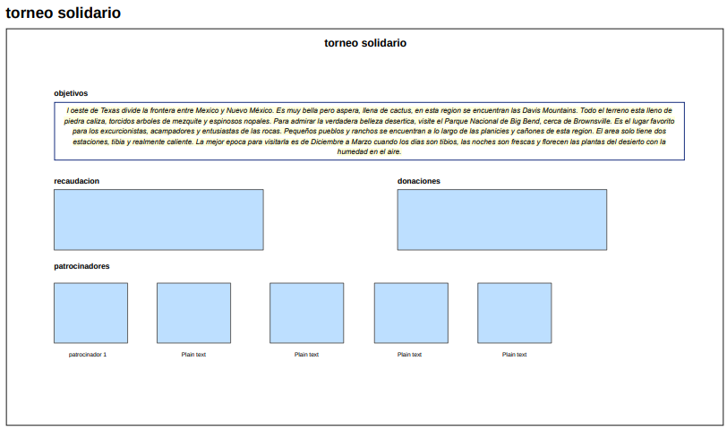
Esta vista presenta la información sobre un torneo solidario, incluyendo sus objetivos, recaudación y patrocinadores

- Vista para retos 

Esta vista muestra diferentes desafíos o retos en los que los usuarios pueden participar. Al clickar en uno de los retos te llevara a la siguiente vista "vista para cada rama profesional" en el que aparecera mas informacion 

- Vista para cada rama profesional 
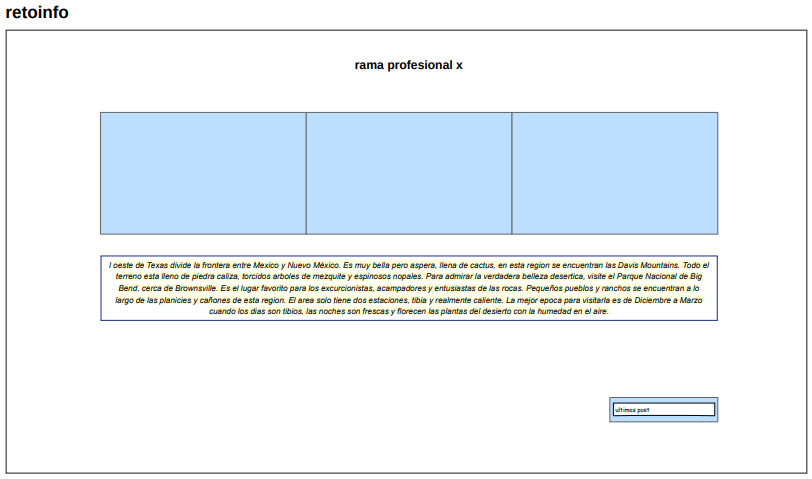
Esta vista proporciona información detallada sobre una categoría profesional específica dentro de los retos, 


### Iconos 
   
- En el menu de la página de la pagina de se muestra este icono que da acceso a la pagina de logeo 


## Uso de la aplicacion 📌

### Cuentas de acceso ✔️
- 👨‍🏫 **Perfil de administrador:** tendra acceso a toda la gestion de la informacion web 
- 👨‍🏫 **Perfil de entrenador:** solamente tendrá acceso a la gestión de su equipo, permitiéndole publicar informacion sobre su equipo y su perfil de usuario 
- 👨‍🏫 **Perfil director torneo:** gestion de las actas de los partidos 
- 👨‍🏫 **Perfil periodista:** mantenimiento de las publicaciones, carrusel fotográfico e imágenes
***
En la página principal se encuentra un menu en el que se mostraran los apartados que ofrecemos 
  - Apartado de equipos para consultar los que van a participar 
  - Apartado para que se puedan inscribir los equipos
  - Apartado "Torneo Solidario"
  - Apartado "Reglamento" con sus horarios, clasificacion, final, galería 
  
## Software de la aplicacion 📌 <a name="software"></a>

### Estructura del proyecto 
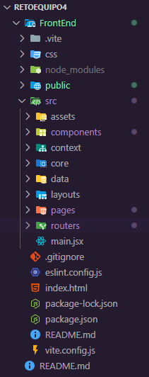

### 🌐 API


| Método | Endpoint |  Descripción |
|-----------|-----------|-----------|
| GET   | api/usuarios   | Obtiene la listas de usuarios   |
| POST    | api/usuarios    | Crea un nuevo usuario    |
| GET    | api/jugadores    | Obtiene la lista de  jugadores    |


``` java
Ejemplo: 
{
  "nombre": "Juan Pérez",
  "email": "juan@example.com"
  "activo": true,
  "perfil": "administrador"
}
```
### Autentificacion 
``` java
Authorization: Bearer <token>
```
### Errores comunes 
| Código | Mensaje |  Explicación |
|-----------|-----------|-----------|
| 400   | "Datos inválidos"   | Algun campo es incorrecto   |
| 401    | "No autorizado"    | Token invalido    |
| 404    | "Usuario no encontrado"   | ID no existe    |


## Mejoras del producto y lo que falta 


## Herramientas utilizadas  
- Visual Studio Code 
- AWS 
- MySQLWorkbech 
- JavaScrip
- PhpMainer 
- Color-generator 
  
